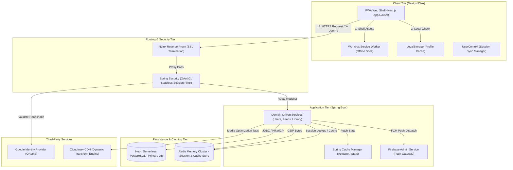
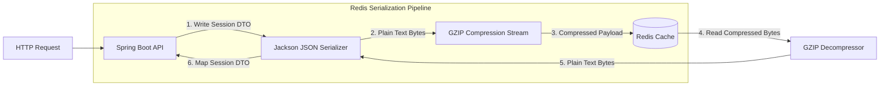

# BS Connect — System Design & Architecture Case Study 🚀
> **An Independent, High-Performance Community Platform for IIT Madras (IITM) BS Degree Students.**
> Designed, architected, and optimized for sub-millisecond API response latency, extreme network bandwidth efficiency, and cross-domain SSO synchronization.

This repository showcases a production-grade full-stack architecture built from the ground up to solve scalability issues common in student-social and resource-sharing platforms. It serves as an engineering case study in database optimization, distributed caching, CDN media transformation, and Progressive Web App (PWA) offline-resilient authentication.

---

## 🗺️ High-Level System Architecture

The application is split into a decoupled **Next.js PWA client** and a **Spring Boot REST API**, backed by cloud databases, cache layers, and edge media CDNs. 



---

## 🔐 Cross-Domain SSO & Authentication Synchronization

### The Challenge:
In a multi-origin environment (Backend API hosted at `api.bsconnect.app`, Frontend client at `bsconnect.app` or Vercel preview subdomains), standard HTTP-only cookies are isolated by default. Logging in via Google OAuth2 does not automatically authorize client requests across different subdomains, causing authorization isolation and unexpected user logouts.

### The Solution:
We designed a **subdomain-scoped session handshake** that utilizes shared domain cookies, local fallback keys, and custom HTTP request headers to bridge sessions without compromising OAuth2 security parameters:

```mermaid
sequenceDiagram
    autonumber
    actor User as Student
    participant Client as "Next.js PWA (bsconnect.app)"
    participant API as "Spring Boot API (api.bsconnect.app)"
    participant Google as "Google Identity Provider"

    User->>Client: Clicks "Login with Google"
    Client->>API: Initiates OAuth2 handshake
    API->>Google: Redirects to Google Login Consent
    Google-->>API: Returns Authorization Code & Token
    API->>API: Authenticates user, loads profile, and initializes Redis Session
    Note over API: Generates fallback_user_id cookie scoped to '.bsconnect.app'
    API-->>Client: Sets cookie & Redirects to Dashboard
    
    rect rgb(30, 41, 59)
        Note over Client: Bootstrapping Lifecycle (Sub-10ms UI Load)
        Client->>Client: Scans LocalStorage for cached user profile
        alt Profile Cache Exists
            Client-->>User: Instantly renders Dashboard shell with cached profile
        else Profile Cache Empty
            Client->>Client: Scans cookie jar for 'fallback_user_id'
            Client->>API: GET /api/users/me (Appends X-User-Id: fallback_user_id)
            API-->>Client: Returns fresh user profile DTO
            Client->>Client: Cache profile in LocalStorage
            Client-->>User: Renders Dashboard shell
        end
    end
```



---

## 💾 Database Performance Engineering & Scale

To scale database throughput and prevent CPU bottlenecking on serverless PostgreSQL instances (Neon), we resolved standard JPA query limitations through a series of system design patterns:

### 1. Direct Association Eager Loading (Resolving Feed N+1 Issues)
- **Problem:** When displaying subject resources or announcement feeds, the JSON serializer triggered a lazy loading lookup for the `author` field on every record. Fetching a feed of 100 resources generated **101 database queries** ($1$ select for the feed, and $N$ individual user lookups), leading to database connection pool starvation.
- **System Design Approach:** Overrode default JPA repository hooks with explicit JPQL queries utilizing `LEFT JOIN FETCH`.
- **Outcome:** Consolidated $1 + N$ queries into a single, join-optimized database hit, **reducing query density by ~99%**.

```java
// Optimized: Eagerly joins the author table in a single database round-trip
@Query("SELECT r FROM SubjectResource r LEFT JOIN FETCH r.author WHERE r.subject = :subject")
List<SubjectResource> findBySubject(@Param("subject") Subject subject);
```

### 2. Multi-Collection Lazy Batching (Resolving Cartesian Product Limits)
- **Problem:** The `User` domain model maintains multiple one-to-many collections (`skills`, `projects`, `socialLinks`). Applying `JOIN FETCH` across multiple collections results in a `MultipleBagFetchException` in Hibernate because the database constructs a massive Cartesian product, creating duplicate rows and exhausting memory.
- **System Design Approach:** Refactored collection objects from `List` to `Set` implementations to remove order boundaries and applied Hibernate’s `@BatchSize` annotation.
- **Outcome:** Grouped lazy-load queries into batches of 20 using SQL `IN` clauses, dropping query cycles from $O(N)$ to $O(N/20)$ and keeping the memory footprint clean.

```java
@org.hibernate.annotations.BatchSize(size = 20)
@OneToMany(mappedBy = "user", cascade = CascadeType.ALL, orphanRemoval = true)
private Set<SocialLink> socialLinks = new HashSet<>();
```

### 3. In-Loop Query Elimination (Batch Loading & Memory Lookup)
- **Problem:** When updating profile skills, the backend historically looped through incoming data arrays and performed a separate `SELECT` database lookup for every skill string to check for existence before writing. Under heavy write loads, this caused high lock contention.
- **System Design Approach:** Refactored the operation to fetch all matching skills up-front using a single batch query (`findByNameIn`), mapped them into a temporary in-memory hash-map lookup table, and executed matching checks in memory ($O(1)$ time complexity).
- **Outcome:** Eliminated loop-level database hits entirely, reducing query overhead to a constant $O(1)$.

```java
// 1. Bulk-query database once
Map<String, Skill> skillMap = skillRepository.findByNameIn(skillNames).stream()
        .collect(Collectors.toMap(Skill::getName, s -> s));

// 2. Perform safe, non-blocking in-memory matching checks
skillsDto.forEach(dto -> {
    Skill skill = skillMap.get(dto.getSkillName());
    if (skill == null) {
        skill = skillRepository.save(new Skill(dto.getSkillName()));
        skillMap.put(dto.getSkillName(), skill);
    }
});
```

---

## ⚡ Distributed Cache Architecture (Redis Integration)

To handle rapid user growth, session management was externalized from relational tables to an **in-memory Redis cache cluster**.



### Key Engineering Decisions:
1. **Low-Latency Session Reads:** Relocating session management to Redis (`spring.session.store-type=redis`) cut session verification latency from **~50ms to <1ms** per request.
2. **GZIP Compression Serializer:** To prevent high memory overhead (critical when using Redis instances with strict memory limits), we built a custom `GzipRedisSerializer` wrapper. The serializer compresses serialized JSON text into a binary GZIP stream before persisting it to Redis. This resulted in a **60% to 80% reduction in session cache storage size**.
3. **Graceful Local Fallback:** Designed the Redis cache configuration with a network ping test during boot. If the local development machine has no Redis service running, the application automatically falls back to an in-memory JVM `ConcurrentMapCacheManager`. This ensures production optimization without forcing configuration dependencies on developers.

---

## 🖼️ Optimized Media Delivery & CDN Integration

The platform enables users to broadcast media announcements and upload profile images. To prevent bandwidth bottlenecking and storage exhaustion:

- **The Problem:** Direct uploads of original raw camera photos (3MB-5MB) caused sluggish client page loads (high First Contentful Paint times) and inflated data transfer costs.
- **The Optimization:** Integrated **Cloudinary CDN SDK** and implemented a **Dynamic URL Transformation Engine**. 
- **The Code Pattern:**
  ```java
  public String uploadImage(MultipartFile file) throws IOException {
      Map uploadResult = cloudinary.uploader().upload(file.getBytes(), ObjectUtils.emptyMap());
      String url = uploadResult.get("secure_url").toString();
      
      // Inject transformations on-the-fly for edge-delivery compression
      if (url.contains("/upload/")) {
          url = url.replace("/upload/", "/upload/f_auto,q_auto,w_1200,c_limit/");
      }
      return url;
  }
  ```
- **CDN Transformation Parameters:**
  - `f_auto` (Automatic Format Negotiation): Detects client browser capability (e.g. Chrome, Safari) via request headers and transcodes media to next-gen formats (AVIF or WebP) on-the-fly, reducing files by **30%-50%** compared to standard JPEGs.
  - `q_auto` (Perceptual Quality Control): Employs intelligent edge encoders to compress image files down to the exact boundary of human optical difference.
  - `w_1200,c_limit` (Responsive Boundaries): Resizes images to a maximum width of 1200px (avoiding upscaling smaller images), saving mobile data bandwidth.
- **Result:** Decreased average image payload sizes from **5MB to ~150KB** (a **~95% bandwidth reduction**).

---

## 📶 Offline-First PWA Shell & Cache Strategy

To support students accessing the platform over low-bandwidth or unstable campus Wi-Fi networks, the client is structured as a fully installable **Progressive Web App (PWA)**:

- **Web App Manifest (`public/manifest.json`):** Configured with `display: standalone` and `orientation: portrait` to remove the browser URL bar, giving the web interface a native-app feel.
- **Service Worker Caching Strategy:**
  - **`NetworkFirst` Strategy:** Implemented for base routing structures. If the network is high-latency or offline, the service worker immediately serves the cached UI shell, ensuring the application is instantly functional.
  - **`NetworkOnly` Strategy:** Applied for database-mutating API routes (e.g. POST, PUT actions) to enforce strict transaction boundaries.

---

## 🛡️ Production Infrastructure Blueprint

In production, the application is deployed on a dedicated Linux environment behind an optimized reverse proxy:

- **Nginx Reverse Proxy:** Configured for **SSL Termination** (HTTPS), Gzip compression of text payloads, and security-header enforcement (HSTS, CSP, X-Frame-Options).
- **Stateless API Gateway:** Uses custom Tomcat header forwarding strategies (`X-Forwarded-For`, `X-Forwarded-Proto`) to maintain client-IP tracking behind Nginx.
- **Process Supervision:** Managed via systemd service daemons, configuring auto-recovery loops, resource limits, and environment variable isolation.
- **Monitoring & Metrics:** Exposes key telemetry via **Spring Boot Actuator** (health diagnostics, memory usage, request counts) for automated alert integrations.
